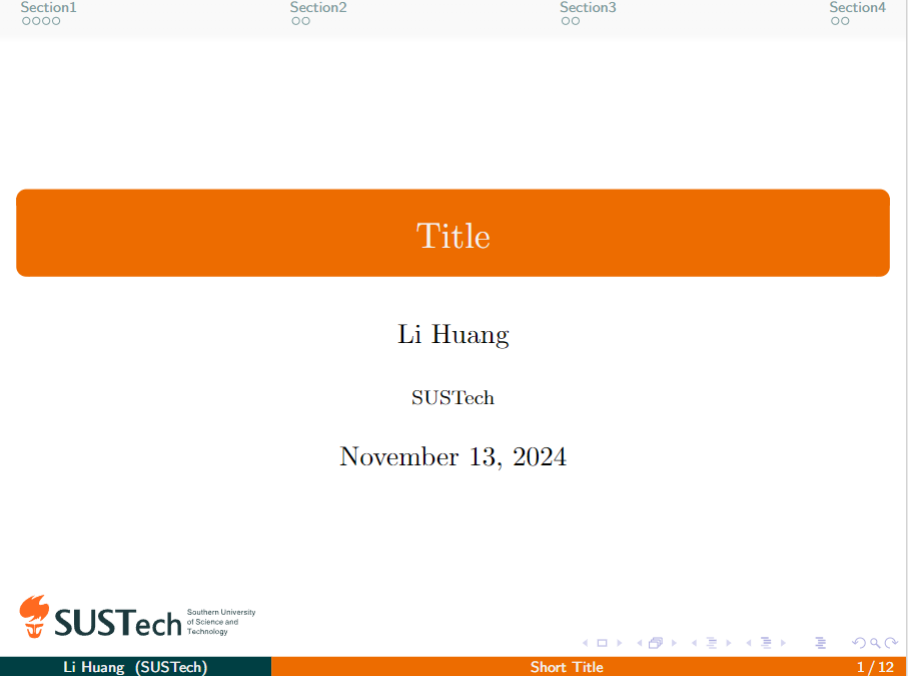
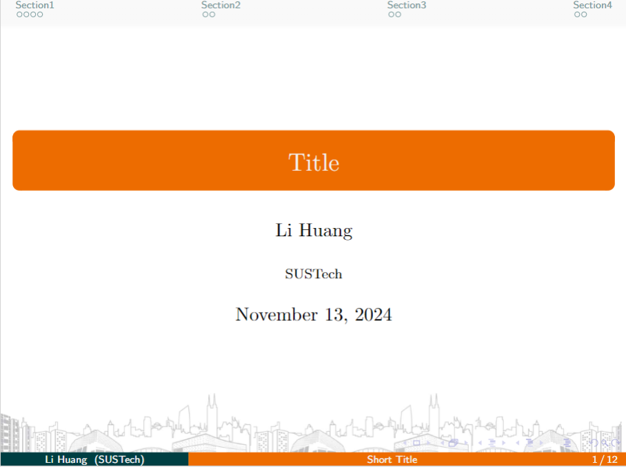

# SUSTech Beamer Theme

This is a LaTeX beamer theme for Southern University of Science and Technology (SUSTech). There are 2 choices of image showing at the bottom of the slides:

- SUSTech logo

    

    
    

- SUSTech buildings

    

    
    

Just simply use `\usetheme{sustechlogo}` or `\usetheme{sustechbuildings}` to choose the image you like.

> **Note**: Since I am just a beginner of LaTeX, the code may not be perfect. If you have any suggestions or find any bugs, please feel free to open an issue or pull request.